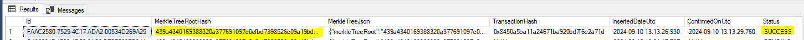
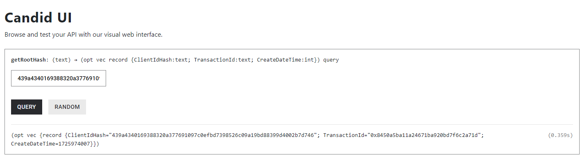
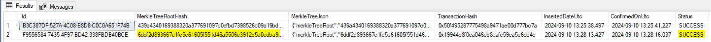
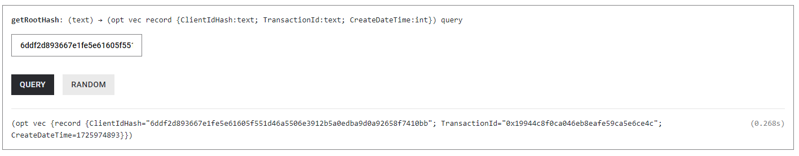
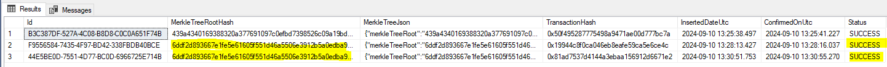
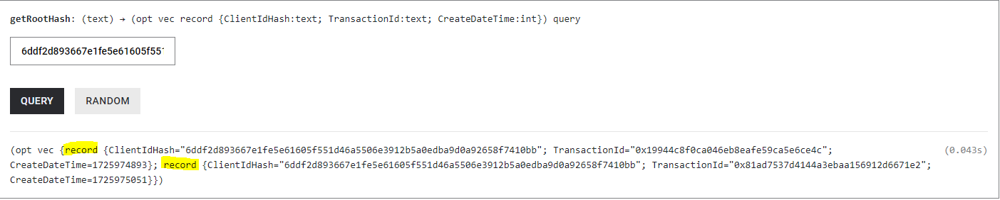

# MS2: Hashing Mechanism Development and Integration
Objectives: 
* To finalize the development of the Hashing Mechanism and integrate it with the A.DNA Data Vault, enabling data fingerprinting and publishing to the ICP blockchain.

Deliverables:
* Complete and fully integrated Hashing Mechanism.

## Implementation

We have refactored the A.DNA Hashing Service to support multiple Blockchains to store the hashes. To implement a new provider a class inherited from `IHashingBlockchainService` must be implemented. The full implementation can be found in the `src/IcpHashingBlockchainService.cs`. Because the A.DNA Software is closed source at this moment we cannot share any more code related to this integration into the A.DNA Vault.
```


```c#
public async Task WritePendingHashes()
{
    //get all hashes that have STATUS=PENDING in ClientHash table
    var pendingClientHashes = await _dataAccess.PendingClientHashes();
    _logger.LogInformation($"Pending hashes {pendingClientHashes.Count}");

    var client = new IcpClientApiClient(_agent, _cannister);

    foreach (var pendingClientHash in pendingClientHashes)
    {
        var rootHash = pendingClientHash.Hash.MerkleTreeRootHash;
        var transactionId = $"0x{Guid.NewGuid():n}";

        var transaction = new Transaction()
        {
            ClientIdHash = rootHash,
            TransactionId = transactionId,
            CreateDateTime = new DateTimeOffset(DateTime.UtcNow).ToUnixTimeSeconds()
        };

        await client.StoreRootHash(rootHash, transaction);
        await _dataAccess.UpdateTransactionHash([pendingClientHash], transactionId);
    }

    await _dataAccess.Success(pendingClientHashes);
}
```

## Usage
The A.DNA Hashing Service runs every month on the 10th. It will create a roothash for the whole data room and stores it on selected blockchain(s). With the modified version we now support `Polygon` and `ICP` blockchain.

## Screenshots
Here are some screenshots showing the hashing process.

### First hash




## Saving new hash




## Saving same hash again





